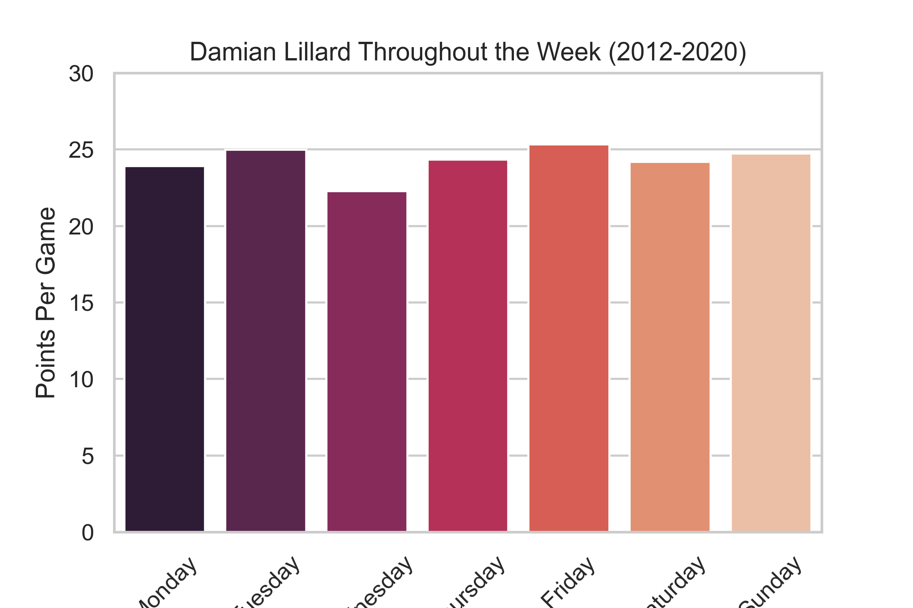

# Damian Lillard PPG - Day of the Week Analysis

---

---

## Contact Information

Rob Savage 

rob.savage@me.com

[LinkedIn](https://www.linkedin.com/in/robsavage/)

[Tableau Public](https://public.tableau.com/profile/rob.savage)

---

## Project Description

The purpose of this project was to take a quick look into Damian Lillard's career Points Per Game statistics through the 2020 season to see if he was more efficient on a certain day of the week.

---

## Tools Used

1. Python (Data Aggregation/Cleaning)

    - Pandas Library

2. NumPy (Calculations)

3. Github (Publishing of Results and Analysis)

4. Jupyter Notebook

5. Seaborn (Visualizations)

6. Matplotlib (Visualizations)

7. Glob (Mass File Merging)

8. `basketball_reference_web_scraper` (Module to Scrape Data from Basketball-Reference.com)

---

## Data Source

https://www.basketball-reference.com/

---

## Steps 

1. Used `basketball_reference_web_scraper` to pull Damian Lillard's seasonal box scores into individual `CSVs`

2. Used `glob` to merge all of the `CSVs` into one data frame

3. Used `Pandas` `datetime` feature to read the `date` column and append a new column that specified the day of the week

4. Used a `groupby` on the day of the week to calculate a `count` on the games and a `mean` on the `points_scored` 

5. Once the new data frame was created, `Seaborn` and `Matplotlib` were employed to create the visualization 

---

## Analysis

Unsurprisingly, Damian Lillard is incredibly consistent on each day of the week with Friday being his most proficient by a slim margin. I felt this was a fun intro to my personal projects utilizing a module that had never used before. Much more complex personal projects will follow. 

